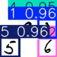
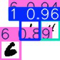
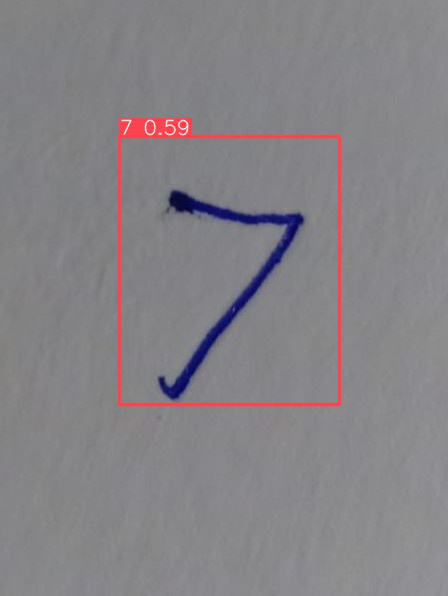

# YOLOv8 Handwritten Digit Detector

A fully functional computer vision pipeline for detecting and classifying handwritten digit instances with YOLOv8. The model is trained on the HashiDigits dataset and packaged with a small trained checkpoint plus example images for quick inference.

This pipeline treats digit recognition as an object detection problem rather than only an image classification problem. That means the model predicts both the digit class and its bounding box location, which is exceptionally useful when an image contains multiple handwritten digits.

## Tech Stack & Core Skills

- **Deep Learning Frameworks:** PyTorch, Ultralytics YOLOv8
- **Computer Vision:** OpenCV, Object Detection, Bounding Box Regression
- **Data Engineering:** Data Augmentation, Transfer Learning
- **Languages & Libraries:** Python, Pandas, Matplotlib, Pillow

## Methodology & Training Workflow

The project utilizes transfer learning to fine-tune a `YOLOv8n` base model to recognize handwritten digits (`1` through `8`).

**Training Strategy:**
1. **Base Initialization:** Loaded pretrained `YOLOv8n` weights to leverage generalized visual features.
2. **Initial Training:** Trained the network on the HashiDigits dataset using an image size of `416px` for rapid convergence.
3. **Iterative Refinement:** Resumed training from intermediate checkpoints.
4. **Advanced Augmentation:** Increased the image resolution to `640px` and enabled advanced data augmentation to improve model robustness and generalization against real-world handwriting variations.
5. **Inference & Validation:** Loaded the best performing checkpoint and ran inference across dataset samples, multi-digit clusters, and challenging real-world handwritten captures.

## Dataset Overview

The project uses the HashiDigits dataset from Roboflow Universe:
[HashiDigits Dataset](https://universe.roboflow.com/hashiwokakero-digits/hashidigits/dataset/2)

**Dataset Summary:**
- 10,000 labeled images total
- 6,999 training images
- 2,001 validation images
- 1,000 test images
- YOLOv8 annotation format
- License: CC BY 4.0

## Results & Visuals

The final validation run reported exceptional performance on the HashiDigits validation split:

| Metric | Value |
| --- | ---: |
| Precision | 99.7% |
| Recall | 99.8% |
| mAP50 | 99.5% |
| mAP50-95 | 99.1% |

*Note: Real-world handwriting inference can still be affected by extreme lighting, low contrast, unusual stroke thickness, or severe resolution drops.*

**Prediction Examples:**

| Dataset-style sample | Multi-digit sample | Real handwriting sample |
| --- | --- | --- |
|  |  |  |

## Repository Structure

```text
docs/assets/                                 Prediction screenshots
notebooks/
  yolov8_handwritten_digit_detection.ipynb   Main training, evaluation, and inference workflow
models/
  best.pt                                    Final trained YOLOv8 checkpoint
examples/                                    Test images for immediate inference validation
data.yaml                                    YOLO dataset configuration mapping
requirements.txt                            Python dependencies
```

## Requirements & Setup

If you wish to run this pipeline locally:
- Install dependencies via `pip install -r requirements.txt`.
- The full 10,000-image dataset is not committed. To retrain, you must acquire the HashiDigits dataset (YOLOv8 format) and place it under a local `data/` directory matching the structure in `data.yaml`.
- For quick inference, load the provided `models/best.pt` checkpoint using the Ultralytics Python API.
